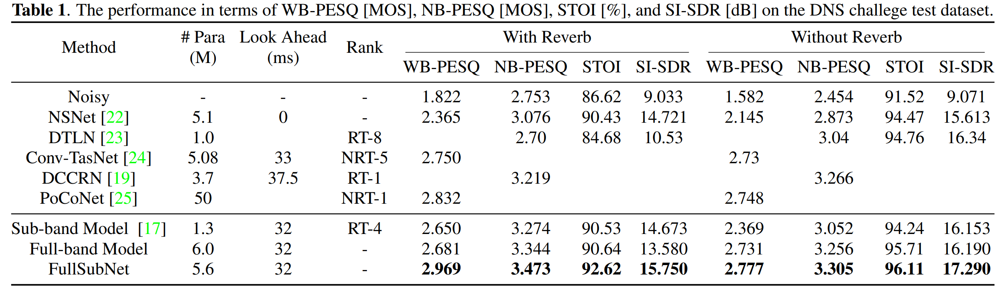

# FullSubNet


This Git repository for the official PyTorch implementation of ["A Full-Band and Sub-Band Fusion Model for Real-Time Single-Channel Speech Enhancement"](https://arxiv.org/abs/2010.15508), submitted to ICASSP
2021.

:blossom: See the demo page in [this link](https://www.haoxiangsnr.com/demo/fullsubnet/).

<p align="center">
  
</p>



You can use all of these things:

- Available models
    - [x] FullSubNet
    - [ ] Delayed Sub-Band LSTM
    - [x] Fullband LSTM Baseline
- Available Datasets
    - [x] Deep Noise Suppression Challenge - INTERSPEECH 2020
    - [ ] Demand + CSTR VCTK Corpus

## Documentation

- [Prerequisites](docs/prerequisites.md)
- Getting Started
  - [FullSubNet & Fullband Baseline](docs/fullsubnet_fullband_baseline.md)

## Citation

If you use this code for your research, please consider citing:

```text
@misc{hao2020fullsubnet,
      title={FullSubNet: A Full-Band and Sub-Band Fusion Model for Real-Time Single-Channel Speech Enhancement}, 
      author={Xiang Hao and Xiangdong Su and Radu Horaud and Xiaofei Li},
      year={2020},
      eprint={2010.15508},
      archivePrefix={arXiv},
      primaryClass={eess.AS}
}
```

## License

[](https://github.com/haoxiangsnr/FullSubNet/blob/main/LICENSE)

